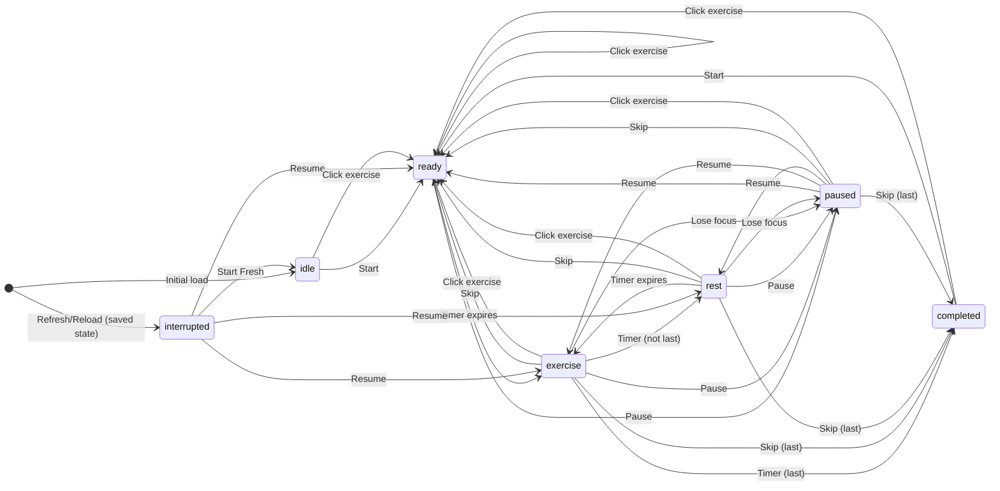

# 7-Minute Workout State Machine

## States

| State | Description |
|-------|-------------|
| `idle` | No workout in progress. Initial state or after "Start Fresh". |
| `ready` | 10-second countdown before an exercise ("Get ready for X"). |
| `exercise` | 30-second exercise period. |
| `rest` | 10-second rest between exercises. |
| `paused` | Workout stopped by user; Resume button available on main UI. |
| `interrupted` | Workout interrupted (refresh or Restart); Resume dialog blocks until user chooses. |
| `completed` | All 13 exercises done. |

## State Variables

- `phase` — Current phase
- `previousPhase` — Phase before pause (for resume)
- `currentExerciseIndex` — 0–12
- `timeRemaining` — Seconds left in current phase
- `completedExercises` — Indices of finished exercises

## Phase Flow (Timer-Driven)

```
ready (READY_DURATION=10s or REST_DURATION=10s)
    → timeRemaining hits 0 → exercise (EXERCISE_DURATION=30s)

exercise
    → timeRemaining hits 0 → if last: completed; else: rest (REST_DURATION=10s)

rest
    → timeRemaining hits 0 → exercise (next)
```

## Button Availability by State

| Button | idle | ready | exercise | rest | paused | interrupted | completed |
|--------|------|-------|----------|------|--------|-------------|-----------|
| Play/Pause | ▶️ Start (green) | ⏸️ Pause (yellow) | ⏸️ Pause (yellow) | ⏸️ Pause (yellow) | ▶️ Resume (blue) | — (dialog blocks) | ▶️ Start (green) |
| Skip | ❌ | ✅ | ✅ | ✅ | ✅ | — | ❌ |
| Restart | ❌ | ✅ | ✅ | ✅ | ✅ | — | ✅ |
| Sound | ✅ | ✅ | ✅ | ✅ | ✅ | — | ✅ |
| Exercise List | ✅ | ✅ | ✅ | ✅ | ✅ | — | ✅ |

**Note:** The Play/Pause button is a single unified button that changes label, color, and behavior based on state.

## State Transitions

### From `idle`
- **Play/Pause (Start)** → `ready` (first exercise)
- **Exercise click** → `ready` (jump to exercise)

### From `ready`
- **Timer reaches 0** → `exercise`
- **Play/Pause (Pause)** → `paused` (previousPhase=ready)
- **Voice dropdown focus** → `paused` (same as Pause)
- **Skip** → `ready` (next exercise) OR `completed` (if last)
- **Restart** → `interrupted` (shows Resume dialog)
- **Exercise click** → `ready` (restart current or jump to another)

### From `exercise`
- **Timer reaches 0** → `rest` (if more exercises) OR `completed` (if last)
- **Play/Pause (Pause)** → `paused` (previousPhase=exercise)
- **Voice dropdown focus** → `paused` (same as Pause)
- **Lose focus** (tab switch, Alt+Tab, another app) → `paused`
- **Skip** → `ready` (next exercise) OR `completed` (if last)
- **Restart** → `interrupted` (shows Resume dialog)
- **Exercise click** → `ready` (jump to exercise)

### From `rest`
- **Timer reaches 0** → `exercise` (next exercise)
- **Play/Pause (Pause)** → `paused` (previousPhase=rest)
- **Voice dropdown focus** → `paused` (same as Pause)
- **Lose focus** (tab switch, Alt+Tab, another app) → `paused`
- **Skip** → `ready` (next exercise) OR `completed` (if last)
- **Restart** → `interrupted` (shows Resume dialog)
- **Exercise click** → `ready` (jump to exercise)

### From `paused`
- **Play/Pause (Resume)** → `previousPhase` (ready/exercise/rest)
- **Play/Pause (Resume, timer=0)** → advance from previousPhase
- **Skip** → `ready` (next exercise) OR `completed` (if last)
- **Restart** → `interrupted` (shows Resume dialog)
- **Exercise click** → `ready` (jump to exercise)

### From `interrupted` (Resume dialog visible)
- **Resume** → `previousPhase` (ready/exercise/rest)
- **Start Fresh** → `idle`

### From `completed`
- **Play/Pause (Start)** → `ready` (starts new workout immediately)
- **Restart** → `ready` (starts new workout immediately, no dialog)
- **Exercise click** → `ready` (jump to exercise)

## Persistence

- **Saved to localStorage:** `ready`, `exercise`, `rest`, `paused`
- **Not saved:** `idle`, `completed`, `interrupted`
- **Refresh/Reload:** If saved state exists → restore state, enter `interrupted` (show Resume dialog)

## State Invariants

1. **previousPhase** is only set when entering `paused` state
2. **previousPhase** is cleared when entering any active state (ready/exercise/rest)
3. From `paused`, you can always return to a valid active state via Resume, Skip, Restart, or Exercise click
4. From `interrupted`, you must choose Resume or Start Fresh (dialog blocks)
5. From `completed`, you can restart or jump to any exercise
6. Exercise list clicks always go to `ready` state regardless of current state (except when interrupted)
7. Timer only runs in `ready`, `exercise`, and `rest` states
8. All state resets (Start Fresh, restart from completed) clear previousPhase

## Dead End Prevention

- No state is unreachable from any other state
- `completed` can exit via Restart or Exercise click
- `paused` can exit via Resume, Skip, Restart, or Exercise click
- `interrupted` can exit via Resume or Start Fresh (dialog buttons)
- All active states can be paused and resumed
- Exercise list provides universal navigation to any exercise from any state (except interrupted)

## UI Layout

1. **Audio Controls** (Voice & Volume) - Collapsible on mobile via Sound button
2. **Control Buttons** - Play/Pause, Skip, Restart, Sound (always visible)
3. **Workout Status** - Timer and status badge ("GET READY", "EXERCISE", "REST", "PAUSED")
4. **Exercise List** - Full-width buttons for all 13 exercises

## Button Colors

- **Green** - Start button (idle/completed states)
- **Blue** - Resume button (paused state)
- **Yellow** - Pause button (active workout), Skip button
- **Red** - Restart button
- **Gray** - Sound button (secondary), disabled buttons

## Exercise Button Colors

- **Gray** (`--bg-secondary`) - Idle/not started exercises
- **Green** (`--color-exercise`) - Completed exercises
- **Blue** (`--color-ready`) - Current exercise during exercise phase
- **Orange** (`--color-rest`) - Current exercise during ready/rest phases

## Audio Features

- **Speech Synthesis** - Announces exercises, countdowns (3-2-1), "halfway" at 15s
- **Voice Selection** - Dropdown with system voices (prefers en-US by default)
- **Volume Control** - 0-100% slider
- **Sound Effects** - Whistle at countdown 0, completion sound
- **Settings Persistence** - Voice and volume saved to localStorage

## State Diagram



