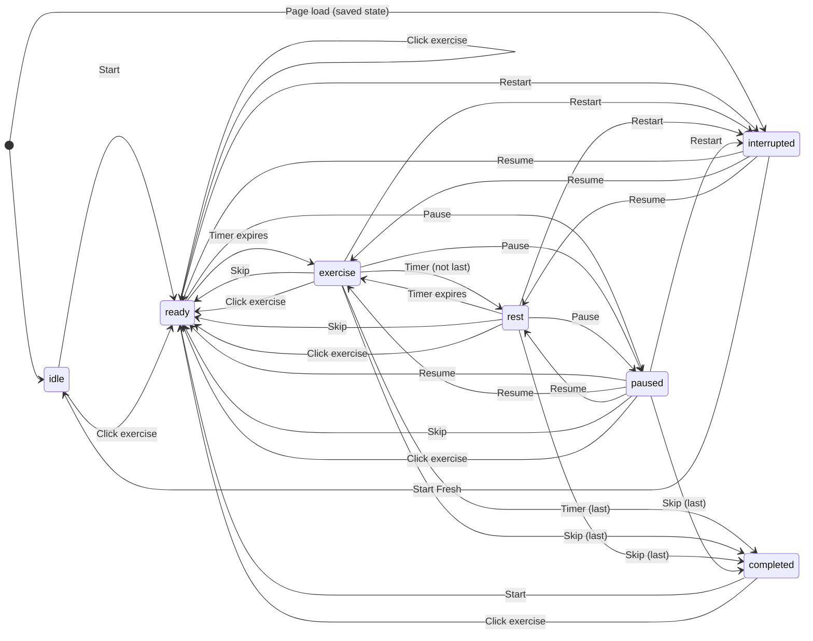

# Workout State Machine

## Phases

| Phase | Description |
|-------|-------------|
| `idle` | No workout in progress. Initial state or after "Start Fresh". |
| `ready` | Countdown before an exercise ("Get ready for X"). |
| `exercise` | Active exercise in progress. |
| `rest` | Rest period between exercises. |
| `paused` | Workout stopped by user; Resume button available on main UI. |
| `interrupted` | Workout interrupted (refresh or Restart); Resume dialog blocks until user chooses. |
| `completed` | All 13 exercises done. |

## State Variables

- `phase` — Current phase
- `previousPhase` — Phase before pause (for resume)
- `currentExerciseIndex` — 0–12
- `timeRemaining` — Seconds left in current phase
- `completedExercises` — Indices of finished exercises

## Phase Flow (Timer-Driven)

```
ready (READY_DURATION=10s or REST_DURATION=10s)
    → timeRemaining hits 0 → advancePhase
    → exercise (EXERCISE_DURATION=30s)

exercise
    → timeRemaining hits 0 → advancePhase
    → if last exercise → completed
    → else → rest (REST_DURATION=10s)

rest
    → timeRemaining hits 0 → advancePhase
    → exercise (next)
```

## User Actions

### Start (Play/Pause button when idle or completed)
- **From:** `idle`, `completed`
- **To:** `ready` (exercise 0)
- **Effect:** `startWorkout()` — reset state, speak "Get ready for Jumping Jacks", start 10s timer

### Pause (Play/Pause button when running)
- **From:** `ready`, `exercise`, `rest`
- **To:** `paused`
- **Effect:** `pauseWorkout()` — store `previousPhase`, stop timer, save state

### Resume (Play/Pause button when paused)
- **From:** `paused`
- **To:** `previousPhase` (ready, exercise, or rest)
- **Effect:** `resumeWorkout()` — restore phase, restart timer; if `timeRemaining === 0`, call `advancePhase()` instead

### Skip
- **From:** `ready`, `exercise`, `rest`, `paused` (no-op from idle, completed, interrupted)
- **Effect:** Mark current exercise completed, move to next exercise’s `ready` phase
- **Special:** If on last exercise → `completed` (completion sound + "Workout complete!")

### Restart
- **From:** any active state
- **Effect:**
  - If `completed` → `ready` (new workout)
  - Else → `interrupted` (pause + show Resume dialog)

### Interrupted state — Resume dialog

When in `interrupted`, the dialog blocks interaction. User must choose:

| Button | To | Effect |
|--------|-----|--------|
| **Resume** | `previousPhase` | Hide dialog, `resumeWorkout()` |
| **Start Fresh** | `idle` | Hide dialog, `clearSavedState()` |

### Click Exercise (in list)
- **From:** any state
- **Effect:** `jumpToExercise(index)` — go to that exercise’s `ready` phase
  - Set `currentExerciseIndex = index`
  - Mark all earlier exercises as completed
  - `timeRemaining = REST_DURATION` (10s)
  - Speak "Get ready for [exercise]"
  - Start timer

## Persistence

- **Saved:** `ready`, `exercise`, `rest`, `paused` (to localStorage)
- **Not saved:** `idle`, `completed`, `interrupted`
- **On load:** If saved state exists → restore state, enter `interrupted` (show Resume dialog)

## Button States

| Phase | Play/Pause | Skip | Restart |
|-------|------------|------|---------|
| idle | Start (enabled) | disabled | disabled |
| ready, exercise, rest | Pause (enabled) | enabled | enabled |
| paused | Resume (enabled) | enabled | enabled |
| interrupted | — (dialog blocks) | — | — |
| completed | Start (enabled) | disabled | enabled |

## State Diagram


